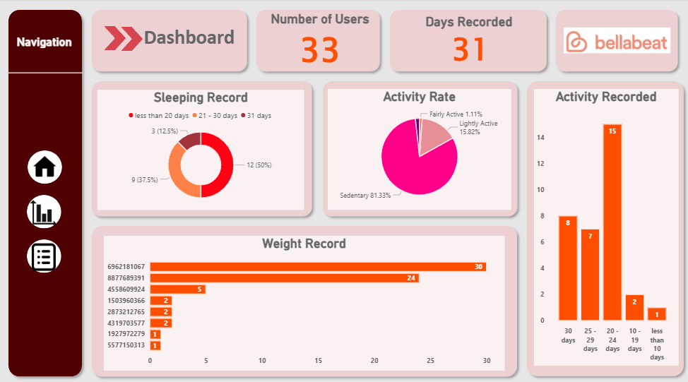
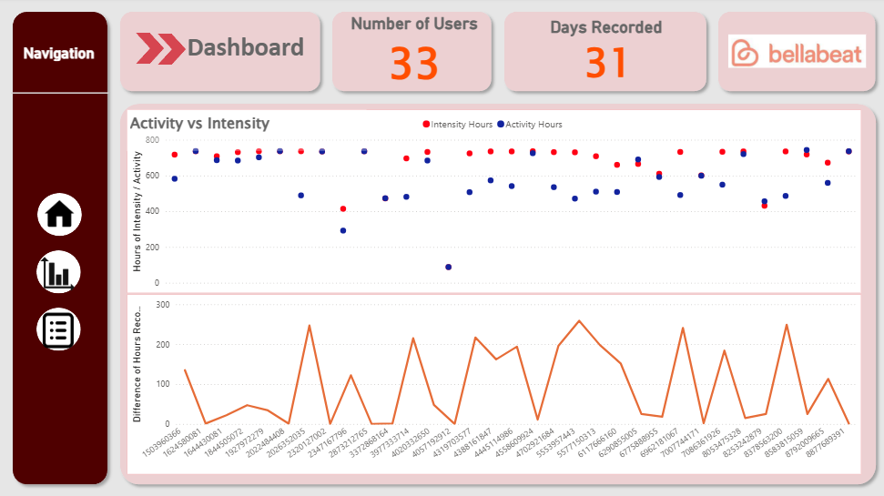
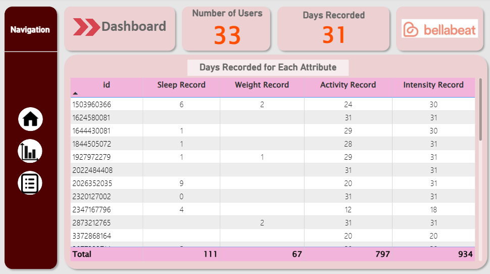

## Bellabeat Data Analysis Report

This project analyses smart device usage to provide insights for Bellabeat's product marketing strategy and increase user engagement. I used SQL to clean, transform and analyse data. After completing my analysis, I created my dashboard using Power BI. As for the report, I use R Markdown to write the report and Tableau to produce the visualization for this report.

[View full report here](https://rpubs.com/wanhuda/1326788)

Dashboard:
 

